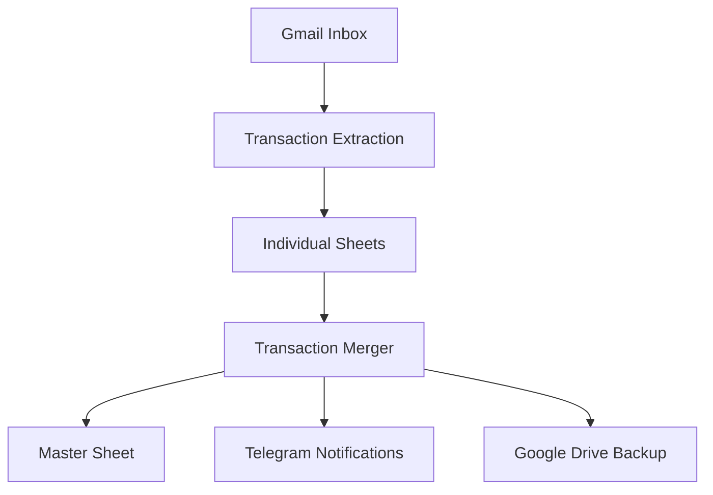

# Spend Analysis Optimizer

A comprehensive personal finance tracking system that automatically extracts transaction data from Gmail and provides intelligent spending analysis with budget tracking and Telegram notifications.

## 🚀 Features

- **Automated Transaction Extraction**: Parses bank transaction emails from Gmail
- **Multi-Bank Support**: ICICI, HDFC, SBI, and American Express
- **Dual-User System**: Separate processing for multiple family members
- **Smart Categorization**: Automatic transaction categorization with merchant detection
- **Budget Tracking**: Monthly budget limits with real-time alerts
- **Telegram Notifications**: Comprehensive spending summaries and alerts
- **Google Drive Backup**: Automated data backup and recovery
- **Performance Optimized**: Bank-wise extraction to avoid timeout issues

## 📁 System Architecture

```
Spend_Analysis_Optimizer/
├── Transactions-Surya.js      # Primary user transaction extractor
├── Transactions-Namita.js     # Secondary user transaction extractor  
├── Transaction-Merger.js      # Data consolidation and notifications
├── config.template.js         # Configuration template
├── REFACTORING_GUIDE.md      # Technical implementation details
└── CHANGELOG.md              # Version history
```

## 🔧 Setup Instructions

### 1. Configuration Setup
```bash
# Copy template and configure
cp config.template.js config.js
```

Edit `config.js` with your credentials:
- Google Sheets URLs (individual and master sheets)
- Telegram Bot Token and Chat ID
- Gmail account details

### 2. Google Apps Script Deployment
1. Create new Google Apps Script projects for each user
2. Deploy `Transactions-Surya.js` in primary Gmail account
3. Deploy `Transactions-Namita.js` in secondary Gmail account  
4. Deploy `Transaction-Merger.js` in either account

### 3. Google Sheets Setup
Create sheets with these columns:
```
Date | Amount | Info | Category | Bank | Person | Card Last 4 | Merchant | Sub-Category | Notes
```

### 4. Telegram Bot Setup
1. Create bot via @BotFather
2. Get bot token and chat ID
3. Configure in `config.js`

## 🏦 Supported Banks

### ICICI Bank
- **Format**: Debit/Credit card transactions
- **Parsing**: Amount, merchant, card details
- **Thread Limit**: 50 (performance optimization)

### HDFC Bank  
- **Format**: Account debits and credit card transactions
- **Parsing**: Amount, merchant, transaction type
- **Thread Limit**: 50 (performance optimization)

### State Bank of India (SBI)
- **Format**: Account transaction alerts
- **Parsing**: Amount, transaction details
- **User**: Namita only

### American Express
- **Format**: Dual format support (pre/post April 2025)
- **Parsing**: Amount, merchant, card details
- **Thread Limit**: Unlimited (complete transaction capture)
- **Cutoff Dates**: 
  - Surya: April 1, 2025
  - Namita: April 22, 2025

## ⚡ Performance Features

### Bank-wise Extraction
```javascript
// Separate functions prevent timeouts
extractICICIOnly()    // ICICI transactions only
extractHDFCOnly()     // HDFC transactions only  
extractAmexOnly()     // Amex transactions only
extractBankTransactions() // All banks (24-hour mode)
```

### Thread Optimization
- **ICICI/HDFC**: Limited to 50 threads for speed
- **Amex**: Unlimited threads for complete capture
- **24-Hour Mode**: Processes last 24 hours only

### Timeout Prevention
- Individual bank functions stay within 6-minute Google Apps Script limits
- Incremental processing avoids re-processing existing data
- Memory-efficient message handling

## 💰 Budget Tracking

### Monthly Limits
```javascript
const BUDGET_LIMITS = {
    'Food': 15000,
    'Grocery': 8000, 
    'Shopping': 5000,
    'Transport': 3000,
    'Entertainment': 2000
};
```

### Alert System
- **75% Warning**: Budget approaching limit
- **100% Alert**: Budget exceeded
- **Weekly Summary**: Spending breakdown
- **Family Overview**: Combined spending analysis

## 📱 Telegram Notifications

### Daily Alerts
- New transaction notifications
- Budget status updates
- Spending summaries

### Weekly Reports
- Category-wise breakdown
- Family spending comparison
- Budget utilization analysis

### Monthly Summary
- Total spending overview
- Category performance
- Budget vs actual analysis

## 🔄 Data Flow



## 🛠️ Technical Details

### Execution Schedule
- **Individual Extractors**: Run every 4-6 hours
- **Merger Script**: Run every 2 hours
- **24-Hour Processing**: Daily incremental updates

### Error Handling
- Gmail API timeout recovery
- Telegram API validation
- Google Drive backup verification
- Duplicate transaction prevention

### Data Schema
```javascript
{
    date: "DD/MM/YYYY",
    amount: 1234.56,
    info: "Transaction description", 
    category: "Food",
    bank: "ICICI",
    person: "Surya",
    cardLast4: "1234",
    merchant: "Merchant name",
    subCategory: "Restaurants",
    notes: "Additional info"
}
```

## 🔐 Security Features

- Sensitive credentials in separate config file
- Config template for public repository
- `.gitignore` prevents credential exposure
- Telegram token validation

## 📊 Analytics Capabilities

### Spending Insights
- Monthly trend analysis
- Category-wise distribution
- Bank-wise spending patterns
- Family member comparison

### Budget Performance
- Real-time budget utilization
- Category overspend alerts
- Monthly budget vs actual
- Savings opportunities identification

## 🚨 Troubleshooting

### Common Issues
1. **Timeout Errors**: Use bank-specific extraction functions
2. **Missing Transactions**: Check Amex thread limits
3. **Telegram Failures**: Validate bot token and chat ID
4. **Duplicate Data**: Ensure proper date filtering

### Performance Optimization
- Use 24-hour mode for daily updates
- Run bank-specific functions for targeted extraction
- Monitor Google Apps Script execution time
- Optimize thread limits based on data volume

## 📈 Version History

- **v2.0.1**: Dashboard removal, documentation update
- **v2.0.0**: Major refactoring with performance optimization
- **v1.0.0**: Initial Gmail extraction system

## 🤝 Contributing

1. Fork the repository
2. Create feature branch
3. Update documentation
4. Test with sample data
5. Submit pull request

## 📄 License

Personal use project - modify as needed for your requirements.

## 🆘 Support

For issues or questions:
1. Check `REFACTORING_GUIDE.md` for technical details
2. Review `CHANGELOG.md` for recent changes
3. Validate configuration in `config.template.js`